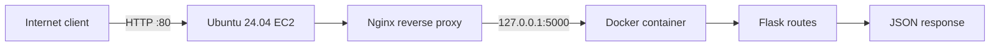
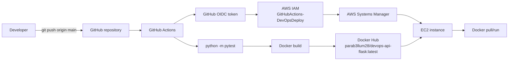

# DevOps Flask API

A small, production-oriented Flask API used to demonstrate the path from application code to an AWS EC2 deployment. The repository implements a Flask application factory, three JSON endpoints, a Pytest health check, Docker containerization, Docker Compose, Docker Hub publishing, GitHub Actions CI/CD, AWS Systems Manager deployment, GitHub OIDC authentication, IAM authorization, and an Nginx reverse proxy on Ubuntu 24.04.

The repository deliberately does not implement Kubernetes, Terraform, Prometheus, Grafana, Redis, a database, HTTPS/SSL termination, a load balancer, or autoscaling.

## Table of Contents

- [Project Status](#project-status)
- [Purpose and Architecture](#purpose-and-architecture)
- [Repository Structure](#repository-structure)
- [Application](#application)
- [API Reference](#api-reference)
- [Requirements and Ignore Files](#requirements-and-ignore-files)
- [Testing](#testing)
- [Local Development](#local-development)
- [Docker](#docker)
- [Docker Compose](#docker-compose)
- [GitHub Actions CI/CD](#github-actions-cicd)
- [AWS EC2 Production Setup](#aws-ec2-production-setup)
- [Nginx Reverse Proxy](#nginx-reverse-proxy)
- [Request and Deployment Flows](#request-and-deployment-flows)
- [Verification](#verification)
- [Troubleshooting](#troubleshooting)
- [Security](#security)
- [Git Workflow](#git-workflow)
- [Resume and Interview Value](#resume-and-interview-value)

## Project Status

The implemented core project is complete. It demonstrates Flask API development, automated testing, Docker containerization, Docker Hub publishing, GitHub Actions CI/CD, AWS EC2 deployment, Nginx reverse proxying, AWS Systems Manager, GitHub OIDC, IAM-based authentication and authorization, Linux server administration, and automated production deployment.

## Purpose and Architecture

The application is intentionally small so that each delivery stage is visible:

1. Flask exposes health, status, and information endpoints.
2. Pytest verifies the health contract without starting a server.
3. Docker packages the application and its Python dependencies.
4. GitHub Actions runs tests, builds the image, pushes `parab3llum28/devops-api-flask:latest` to Docker Hub, and deploys it to EC2 through SSM.
5. The EC2 container listens only on the instance loopback interface.
6. Nginx is the public HTTP entry point and reverse-proxies requests to the container.

The application code is the source of truth for the API. The GitHub Actions workflow is the source of truth for CI/CD values such as the AWS region, EC2 instance ID, IAM role, and Docker image.

## Repository Structure

```text
.
├── .dockerignore              Files excluded from the Docker build context
├── .github/workflows/ci-cd.yml GitHub Actions test, build, push, and deploy workflow
├── .gitignore                 Local Python and environment files excluded from Git
├── Dockerfile                 Image definition and container health check
├── docker-compose.yml         Local Compose service definition
├── requirements.txt           Pinned Flask and Pytest dependencies
├── run.py                     Application entry point
├── app/
│   ├── __init__.py            Flask application factory
│   └── routes.py              Blueprint and three route handlers
└── tests/
    └── test_health.py         Pytest health endpoint test
```

## Application

`app/__init__.py` defines `create_app()`. The factory creates a Flask instance and registers the `api` blueprint from `app/routes.py`. Using a factory keeps application construction explicit and lets tests create an isolated Flask app without importing a running server.

`app/routes.py` defines the `api` blueprint and returns JSON responses with HTTP 200 status codes. There is no database, authentication middleware, background worker, cache, or external service in this application.

`run.py` creates the application with `create_app()` and starts Flask when executed directly. It binds to `0.0.0.0:5000` inside the container so Docker networking can reach it. In production, the container publishes that port only as `127.0.0.1:5000` on EC2; Nginx is the public entry point.

## API Reference

| Method | Path | Response |
|---|---|---|
| `GET` | `/health` | `{"status":"healthy","service":"devops-flask-api"}` |
| `GET` | `/api/status` | `{"service":"devops-flask-api","status":"running"}` |
| `GET` | `/api/info` | `{"application":"DevOps Flask API","version":"1.0.0","environment":"production"}` |

Example local checks:

```powershell
curl.exe http://127.0.0.1:5000/health
curl.exe http://127.0.0.1:5000/api/status
curl.exe http://127.0.0.1:5000/api/info
```

On Linux, use `curl` instead of `curl.exe`.

## Requirements and Ignore Files

`requirements.txt` pins the two project dependencies:

```text
Flask==3.1.0
pytest==8.3.5
```

`.gitignore` excludes the local virtual environment (`venv/`), Python bytecode (`__pycache__/`), Pytest cache (`.pytest_cache/`), and `.env` files. `.dockerignore` excludes those local artifacts plus `.git/` from the Docker build context. The ignore files keep machine-specific files, caches, and credentials out of source control and out of the image build context.

## Testing

The test in `tests/test_health.py` creates the application through `create_app()`, obtains Flask's in-process test client, calls `/health`, and asserts both HTTP 200 and the `healthy` JSON value.

Run the test from the repository root:

```bash
python -m pytest
```

`python -m pytest` is used instead of relying on a standalone `pytest` executable because it runs Pytest through the selected Python interpreter. This keeps the command aligned with the active virtual environment or CI interpreter and fixes the initial `ModuleNotFoundError`/environment mismatch encountered when Pytest was invoked with the wrong interpreter. The workflow uses the same command.

## Local Development

### Windows PowerShell

```powershell
py -3.12 -m venv venv
.\venv\Scripts\Activate.ps1
python -m pip install --upgrade pip
pip install -r requirements.txt
python -m pytest
python run.py
```

If PowerShell execution policy prevents activation, run the project with the interpreter directly:

```powershell
venv\Scripts\python.exe -m pip install -r requirements.txt
venv\Scripts\python.exe -m pytest
venv\Scripts\python.exe run.py
```

### Linux

```bash
python3.12 -m venv venv
source venv/bin/activate
python -m pip install --upgrade pip
pip install -r requirements.txt
python -m pytest
python run.py
```

The development server listens on `http://127.0.0.1:5000` from the host. Stop it with `Ctrl+C`.

## Docker

The Dockerfile uses `python:3.12-slim`, sets `/app` as the working directory, disables `.pyc` generation with `PYTHONDONTWRITEBYTECODE=1`, enables unbuffered logs with `PYTHONUNBUFFERED=1`, installs the pinned requirements without retaining pip's cache, copies only the application and entry point, exposes port 5000, defines a health check, and starts `python run.py`.

Conceptually, each Dockerfile instruction does the following:

| Instruction | Purpose |
|---|---|
| `FROM python:3.12-slim` | Selects a small Python 3.12 base image. |
| `WORKDIR /app` | Makes `/app` the working directory for later commands. |
| `ENV PYTHONDONTWRITEBYTECODE=1` | Avoids bytecode files in the image. |
| `ENV PYTHONUNBUFFERED=1` | Sends Python logs directly to container output. |
| `COPY requirements.txt .` | Copies dependency metadata before source code for build-layer reuse. |
| `RUN pip install --no-cache-dir -r requirements.txt` | Installs Flask and Pytest without pip cache files. |
| `COPY app ./app` | Copies the Flask package. |
| `COPY run.py .` | Copies the entry point. |
| `EXPOSE 5000` | Documents the port used by the application. |
| `HEALTHCHECK ...` | Calls `/health` every 30 seconds after a 10-second startup period, with a 5-second timeout and three retries. |
| `CMD ["python", "run.py"]` | Starts the application when the container runs. |

Build and run it directly:

```bash
docker build -t devops-flask-api .
docker run -d --name devops-flask-api -p 5000:5000 devops-flask-api
curl http://127.0.0.1:5000/health
docker ps
docker inspect --format='{{json .State.Health}}' devops-flask-api
docker stop devops-flask-api
docker rm devops-flask-api
```

The Docker `HEALTHCHECK` uses Python's standard library to request `http://localhost:5000/health`. A successful request means the process is reachable and the health endpoint returned without an exception; it is not a full dependency or performance monitor.

## Docker Compose

`docker-compose.yml` defines one service named `api`. It builds from the repository, names the container `devops-flask-api`, publishes `5000:5000`, sets `restart: unless-stopped`, and supplies `APP_ENV=production`. The Compose file does not define a database, cache, network overlay, or monitoring service.

```bash
docker compose up --build -d
docker compose ps
docker compose logs -f api
curl http://127.0.0.1:5000/health
docker compose down
```

## GitHub Actions CI/CD

`.github/workflows/ci-cd.yml` runs on pushes to `main`. The job runs on `ubuntu-latest` and grants `id-token: write` and `contents: read`. Its configured values are AWS region `eu-north-1`, EC2 instance `i-07952f99afd5b974e`, and Docker image `parab3llum28/devops-api-flask:latest`.

The workflow performs these steps in order:

1. Checks out the repository with `actions/checkout@v4`.
2. Installs Python 3.12 with `actions/setup-python@v5`.
3. Upgrades pip and installs `requirements.txt` plus Pytest.
4. Runs `python -m pytest`.
5. Logs in to Docker Hub using the GitHub Secrets `DOCKER_USERNAME` and `DOCKER_PASSWORD`.
6. Builds the image with the configured Docker Hub tag.
7. Pushes that tag to Docker Hub.
8. Uses `aws-actions/configure-aws-credentials@v6` to obtain temporary AWS credentials by assuming `arn:aws:iam::039974703012:role/GitHubActions-DevOpsDeploy` through GitHub OIDC.
9. Sends an `AWS-RunShellScript` command to the EC2 instance through SSM.
10. Waits for the SSM command to complete.

The Docker Hub secrets contain credentials or a Docker Hub access token as configured by the repository owner. Their values must never be committed, printed, or documented.

## AWS EC2 Production Setup

The production host is an Ubuntu 24.04 EC2 instance in `eu-north-1`. Replace `<EC2_PUBLIC_IP>` in commands below with the current instance public address. The workflow targets the configured instance ID rather than a public IP.

Install Docker on Ubuntu 24.04 using Docker's official repository procedure, then verify it:

```bash
sudo apt-get update
sudo apt-get install -y ca-certificates curl
sudo install -m 0755 -d /etc/apt/keyrings
sudo curl -fsSL https://download.docker.com/linux/ubuntu/gpg -o /etc/apt/keyrings/docker.asc
sudo chmod a+r /etc/apt/keyrings/docker.asc
echo "deb [arch=$(dpkg --print-architecture) signed-by=/etc/apt/keyrings/docker.asc] https://download.docker.com/linux/ubuntu $(. /etc/os-release && echo ${UBUNTU_CODENAME:-$VERSION_CODENAME}) stable" | sudo tee /etc/apt/sources.list.d/docker.list > /dev/null
sudo apt-get update
sudo apt-get install -y docker-ce docker-ce-cli containerd.io docker-buildx-plugin docker-compose-plugin
sudo systemctl enable --now docker
docker --version
```

Install Nginx and enable it:

```bash
sudo apt-get update
sudo apt-get install -y nginx
sudo systemctl enable --now nginx
```

The EC2 security group should allow inbound TCP 80 from the intended public sources. The application port 5000 and SSH port 22 do not need to be public for this deployment design. SSM requires the instance to have outbound connectivity and an attached IAM role; it does not require inbound SSH.

### EC2 Systems Manager

Attach the IAM role `EC2-SSM-Role` to the instance with the AWS managed policy `AmazonSSMManagedInstanceCore`. Install or enable the SSM Agent supplied for Ubuntu, ensure the instance is registered as a managed node, and verify it appears online in Systems Manager. SSM was selected instead of SSH for GitHub deployment because the workflow can execute commands through AWS's managed channel without storing a private key or opening inbound SSH to the Internet.

When commands are run through SSM, they execute as `ssm-user`, not as an interactive login shell with the same groups as the administrator. If `ssm-user` cannot run Docker, add it to the Docker group and start a new session, or use an explicit privilege strategy appropriate to the host. For example:

```bash
sudo usermod -aG docker ssm-user
sudo systemctl restart amazon-ssm-agent
```

Group membership changes do not retroactively change an already-running process. Verify from a new SSM session or use `sudo docker` if that is the host's approved policy.

## Nginx Reverse Proxy

Nginx is installed on the EC2 host and listens publicly on HTTP port 80. The Flask process still listens on port 5000 inside the container, while Docker binds that port to the EC2 loopback address. This separation makes Nginx the only public entry point and prevents direct external access to the application port.

A minimal site configuration is:

```nginx
server {
    listen 80;
    listen [::]:80;
    server_name <EC2_PUBLIC_IP>;

    location / {
        proxy_pass http://127.0.0.1:5000;
        proxy_http_version 1.1;
        proxy_set_header Host $host;
        proxy_set_header X-Real-IP $remote_addr;
        proxy_set_header X-Forwarded-For $proxy_add_x_forwarded_for;
        proxy_set_header X-Forwarded-Proto $scheme;
    }
}
```

The `Host` header preserves the requested host, `X-Real-IP` records the client address seen by Nginx, `X-Forwarded-For` preserves the proxy chain, and `X-Forwarded-Proto` records whether the client used HTTP. This setup documents HTTP only; HTTPS/SSL is not implemented in this project.

After editing the enabled Nginx site, validate and reload it:

```bash
sudo nginx -t
sudo systemctl reload nginx
sudo systemctl status nginx --no-pager
```

Flask binds to `0.0.0.0:5000` inside the container because the container needs to accept traffic on its own network namespace. Docker maps the host side specifically to `127.0.0.1:5000`, so only local host processes such as Nginx can reach it. Nginx maps public port 80 to that loopback service.

## Request and Deployment Flows

### Request flow



### CI/CD and deployment flow



## Exact Production Deployment Commands

The SSM command in the workflow executes the following commands on EC2:

```bash
docker pull parab3llum28/devops-api-flask:latest
docker stop devops-flask-api || true
docker rm devops-flask-api || true
docker run -d --name devops-flask-api --restart unless-stopped -p 127.0.0.1:5000:5000 parab3llum28/devops-api-flask:latest
```

`docker pull` downloads the image pushed by the successful CI job. `docker stop` gracefully stops the previous container; `|| true` keeps deployment going when the first deployment has no existing container. `docker rm` removes the stopped container so the fixed name can be reused; its `|| true` has the same first-deployment behavior. `docker run -d` starts the new version in the background. `--name` gives the workflow a stable container name, `--restart unless-stopped` brings it back after Docker or EC2 restarts unless an operator intentionally stopped it, and `-p 127.0.0.1:5000:5000` keeps the host binding private while forwarding to Flask's container port.

Nginx is managed by systemd and remains enabled across host restarts. Docker is enabled as a system service, and the container's restart policy restores the application after Docker starts. Nginx therefore continues to expose port 80 while the container returns behind it.

### GitHub OIDC and IAM

Configure GitHub as an AWS IAM OIDC identity provider with URL `https://token.actions.githubusercontent.com` and audience `sts.amazonaws.com`. Create the role `GitHubActions-DevOpsDeploy` with a trust relationship that requires the immutable subject claim for this repository's `main` branch:

```text
repo:Parabellum28/devops-api-flask:ref:refs/heads/main
```

The trust policy should also require the OIDC audience `sts.amazonaws.com`. The role's permissions must allow the workflow's SSM operations, including sending a command to the target instance and waiting for or reading command execution status. Restrict resource permissions to the intended instance and commands where the account's IAM policy design supports that granularity.

The workflow does not store long-lived AWS access keys. GitHub issues a short-lived OIDC token for the job; `configure-aws-credentials` presents that token to AWS STS; STS validates the provider, audience, and subject against the role trust policy; and AWS returns temporary credentials for the job. The final deployment path is GitHub Actions → OIDC → AWS IAM → SSM → EC2 → Docker.

## Verification

The following checks were used during setup:

| Layer | Check | Expected result |
|---|---|---|
| Local code | `python -m pytest` | Health test passes. |
| Local app | `curl http://127.0.0.1:5000/health` | HTTP 200 and `status: healthy`. |
| Docker | `docker inspect ... .State.Health` | Container health is `healthy`. |
| EC2 container | `curl http://127.0.0.1:5000/health` | Internal application response from the host. |
| EC2 Nginx | `sudo nginx -t` and `systemctl status nginx` | Valid configuration and active service. |
| EC2 proxy | `curl -I http://127.0.0.1` | Nginx responds on local port 80. |
| Public API | `curl http://<EC2_PUBLIC_IP>/health` and `/api/status` | Public HTTP request reaches Flask through Nginx. |
| CI/CD | GitHub Actions run | Test, image push, OIDC authentication, SSM command, and deployment complete. |

## Troubleshooting

| Symptom | Cause | Diagnosis | Solution |
|---|---|---|---|
| Pytest reports `ModuleNotFoundError` or uses the wrong environment | The `pytest` executable was not associated with the selected virtual environment/interpreter. | Run `python -m pytest` and inspect the active `python` path. | Install dependencies into that interpreter and use `python -m pytest`, as both local setup and CI do. |
| Docker Hub push fails with a token-scope or authorization error | The Docker Hub token lacks permission for `parab3llum28/devops-api-flask`, or the username/token secret is wrong. | Check the Docker Hub repository name, token scope, and the Actions login step without printing the secret. | Grant the token the required repository write scope and update `DOCKER_USERNAME`/`DOCKER_PASSWORD` without exposing values. |
| SSH-based GitHub deployment times out | The design depended on inbound SSH, port 22 networking, a reachable public address, and a private key. | Check security-group rules, route/public IP, SSH service, and workflow timeout. | Replace SSH deployment with SSM, attach `EC2-SSM-Role`, install/verify the SSM Agent, and use the OIDC-authenticated AWS CLI. |
| `AssumeRoleWithWebIdentity` fails | The IAM trust relationship's GitHub subject did not exactly match the immutable branch claim. | Compare the trust policy condition with `repo:Parabellum28/devops-api-flask:ref:refs/heads/main`; also verify audience and workflow `id-token: write`. | Correct the subject condition, provider URL, audience, role ARN, and branch trigger. |
| SSM command cannot run Docker as `ssm-user` | SSM commands run as `ssm-user`, whose Docker group membership may be absent or stale. | Run `whoami`, `id`, and `docker ps` through SSM; inspect agent and command invocation output. | Add `ssm-user` to the Docker group and use a new session, or use the host's approved `sudo docker` policy. |
| Public HTTP request times out | Port 80 is blocked, Nginx is down/misconfigured, the instance has no reachable public route, or the request uses the wrong address. | Check the EC2 public IP, security-group inbound TCP 80 rule, `systemctl status nginx`, `nginx -t`, local port-80 curl, and EC2 route/public networking. | Allow only the intended HTTP source on port 80, reload valid Nginx configuration, and verify locally before testing `<EC2_PUBLIC_IP>`. |

## Security

- Store Docker Hub authentication only in GitHub Secrets named `DOCKER_USERNAME` and `DOCKER_PASSWORD`; never commit or print their values.
- Use GitHub OIDC and the `GitHubActions-DevOpsDeploy` role for short-lived AWS credentials instead of long-lived AWS access keys.
- Restrict the OIDC trust relationship to the repository and `main` branch subject claim, and restrict SSM permissions to the required deployment actions and target.
- Use the EC2 instance role `EC2-SSM-Role` with `AmazonSSMManagedInstanceCore` for the instance-management channel.
- Prefer SSM to SSH for GitHub deployment and avoid exposing SSH publicly when it is not required.
- Keep Docker's host binding at `127.0.0.1:5000:5000`; expose HTTP through Nginx on port 80.
- Do not commit `.env` files, credentials, access keys, private keys, tokens, or other secrets.
- This project documents HTTP only. It does not provide HTTPS/SSL termination or application-level authentication.

## Git Workflow

After a developer changes the project, the normal workflow is:

```bash
git add .
git commit -m "Describe the change"
git push origin main
```

`git add` stages the intended files. `git commit` records a local snapshot. `git push origin main` sends that commit to the GitHub repository `https://github.com/Parabellum28/devops-api-flask.git`. Because the workflow listens for pushes to `main`, GitHub Actions then runs the test, Docker build, Docker Hub push, OIDC authentication, and SSM deployment sequence. A failed test stops the pipeline before image publishing and deployment; a later deployment step does not run unless earlier steps succeed.

## Resume and Interview Value

This project demonstrates the ability to build a Flask API, structure code with an application factory, write automated tests, package an application in Docker, publish versioned build output, automate CI/CD with GitHub Actions, configure IAM and GitHub OIDC, deploy without long-lived cloud keys, operate an Ubuntu EC2 host, use Systems Manager, configure Nginx reverse proxying, troubleshoot networking and identity failures, and verify a production request path end to end.
